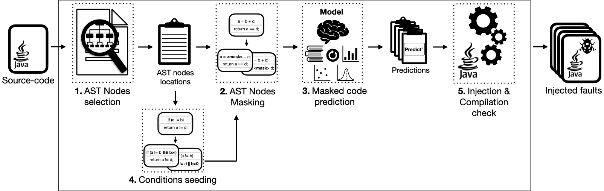

# Efficient Mutation Testing via Pre-Trained Language Models
μBERT generates mutants based on CodeBERT predictions.
This repo contains the implementation and replication package.  

available at: https://doi.org/10.48550/arXiv.2208.06042

    @article{khanfir2022mbert,
      title={Efficient Mutation Testing via Pre-Trained Language Models},
      author={Khanfir, Ahmed and Renzo, Degiovanni and Papadakis, Mike and Traon, Yves Le},
      journal={arXiv preprint arXiv:2301.03543},
      year={2023}
    }

We have implemented our approach as modules in different repositories. 
If you just want to generate mutants using μBERT, you can skip these details and pass to the next subsection.
Otherwise, here's a quick summary of how we implemented our approach:

### AST parsing and location selection:
_Repo_ **(java)**: https://github.com/Ahmedfir/java-business-locations.git

In this step we parse the input java classes and extract the main business-logic nodes to mutate.
You can either clone and build the code yourself or use our released standalone jar directly.
In https://github.com/Ahmedfir/CodeBERT-nt we incorporate the jar and call it directly from the python side, 
to extract the tokens.
 
### Masking and CodeBERT invocation: 

_Repo_ **(python)**: https://github.com/Ahmedfir/cbnt

This repo contains the core implementation of our approach.
It provides APIs to mask tokens, invoke CodeBERT to predict alternative replacements for them and process them, 
i.e. putting them in place in the original program for compilation and test, 
or computing their cosine-embeddings similarity with the original version.  
It has been first developed to provide APIs for the code-naturalness study, 
and we continued extending it for this project' needs.  

_Repo_ **(python)**: https://github.com/Ahmedfir/CodeBERT-nt

This repo contains the code base and evaluation material used to study the code-naturalness via CodeBERT.
It invokes the two previous components.
We incorporate it in our approach and continued adapting it provide required APIs for mutation. 

### Condition seeding:
_Repo_ **(java)**: https://github.com/Ahmedfir/mbert-additive-patterns.git

This repo contains the source-code responsible of proposing new alternative masked conditions, 
to the ones originally provided in the input program.
Our approach then invokes CodeBERT to predict the masked tokens of these proposed new conditions.
You can either clone and build the code yourself or use our released standalone jar directly,
i.e. it's available under `mbertntcall/mBERT-addconditions` in this same repo. 

### Evaluation on Defects4J: 
- The `eval` repo contains our code to run μBERT and PiTest on defects4j bugs.
- To run the fault detection simulations we used:
_Main repo_ **(python)**: 
https://github.com/Ahmedfir/mu-FD-simulation.git
- To run our statistical tests we used:
https://github.com/Ahmedfir/a12stats
- Do not hesitate to contact as if you need any further support.

## run μBERT:

### pre-requirements:

- Python 3.7+: This code has only been tested with Python version 3.7 and above. You can try older versions if you want...
- Python environment: you can use conda or pip to create an environement using `requirements.txt`. If you decide to use pip, just call `env_setup.sh`.
- Java 8: This code has only been tested with Java 8 and above. You can try older versions if you want...
- Dependencies: You will have to clone some repos or call `setup.sh` and it will be done. 
It depends on `https://github.com/Ahmedfir/cbnt`, `https://github.com/Ahmedfir/CodeBERT-nt` and `https://github.com/Ahmedfir/commons` implementations.
So you will have to include them in your `$PYTHONPATH` i.e.:
  - if you want to use PyCharm: 
  go to `Preferences` > `Project:mBERT-mt` > `Project structure` > `+` > `path/to/cloned/cbnt`. 
  Then similarly for `commons`: > `+` > `path/to/cloned/commons` and for `CodeBERT-nt`: > `+` > `path/to/cloned/CodeBERT-nt`.
 
  - if you just want to run the tool via shell (see the `gen_mutants.sh` script): 
  you need to add the dependencies to your `$PYTHONPATH`: `export path/to/cloned/commons:path/to/cloned/cbnt:path/to/cloned/CodeBERT-nt:$PYTHONPATH`

### mutants generation

- You can run μBERT via `mbertntcall/mbert_generate_mutants_runner.py` script. 
The minimum required arguments are the project path and the target classes to mutate.
i.e. `python3 mbert_generate_mutants_runner.py -repo_path path/to/your/project -target_classes path/to/class1,path/to/class2`.
Please check the `get_args()` method for more information on other optional parameters, i.e. 
to get simple replacement mutants only (similar to μBERT ones: https://github.com/rdegiovanni/mBERT), you can pass `-simple_only True` as param.
- We provide also a shell script as example to run the tool from commandline:  `gen_mutants.sh`.
We set it up to generate mutants for a class: `DummyClass.java` available under `test` folder.
You can adapt the script to your needs.

### Customisation 

- We provide our example scripts and configurations to generate mutants for defects4j under `mbertnteval/d4jeval/mbert`.
- Depending on your build configuration you will need to implement the class `MbertProject` under `mbert_project.py` accordingly. Particularly:
  - you should give a way to compile the project in `compile_comand(self)`
  - figure out if the compilation worked or not in `on_has_compiled(self, compilation_output)`
  - similarly, a command to run the tests `test_comand(self)`
  - and, extract the failing tests if any `on_tests_run(self, test_exec_output)`
  - you can find an example implementation (`D4jProject`)  under `eval`
- Then you need to create a request via `mbertntcall.mbert_ext_request_impl.MbertRequestImpl.__init__` with this project as param. Then calling this request, same as 
in method `mbertntcall.mbert_generate_mutants_runner.create_mbert_request` in the class `mbertntcall/mbert_generate_mutants_runner.py`.

### Evaluation:
- We provide our scripts and configurations to generate mutants on defects4j version under `mbertnteval`
- You can call `mbertnteval/d4jeval/exec_pid_bid.sh` to run either our tool or the used baselines. 
You may need to adapt or provide your own config files instead of the `*_config.yml` ones provided under `mbertnteval/d4jeval/mbert` and `mbertnteval/d4jeval/pit`.
Here are example commands calling the `mbertnteval/d4jeval/exec_pid_bid.sh` script, to generate mutants for Cli 13, using:
  - mBERT (All): you can call `./exec_pid_bid.sh ~/PycharmProjects/mBERTa/mbertnteval/d4jeval/mbert/d4j_process_pid_bid.py Cli_13.src.patch.csv ~/PycharmProjects/mBERTa/mbertnteval/d4jeval/mbert/mbert_config.yml`
  - PiTest (All): you can call `./exec_pid_bid.sh ~/PycharmProjects/mBERTa/mbertnteval/d4jeval/pit/d4j_process_pid_bid.py Cli_13.src.patch.csv ~/PycharmProjects/mBERTa/mbertnteval/d4jeval/pit/pit_config.yml`
  - PiTest-rv (All): you can call `./exec_pid_bid.sh ~/PycharmProjects/mBERTa/mbertnteval/d4jeval/pit/d4j_process_pid_bid.py Cli_13.src.patch.csv ~/PycharmProjects/mBERTa/mbertnteval/d4jeval/pit/pit_rv_config.yml`
